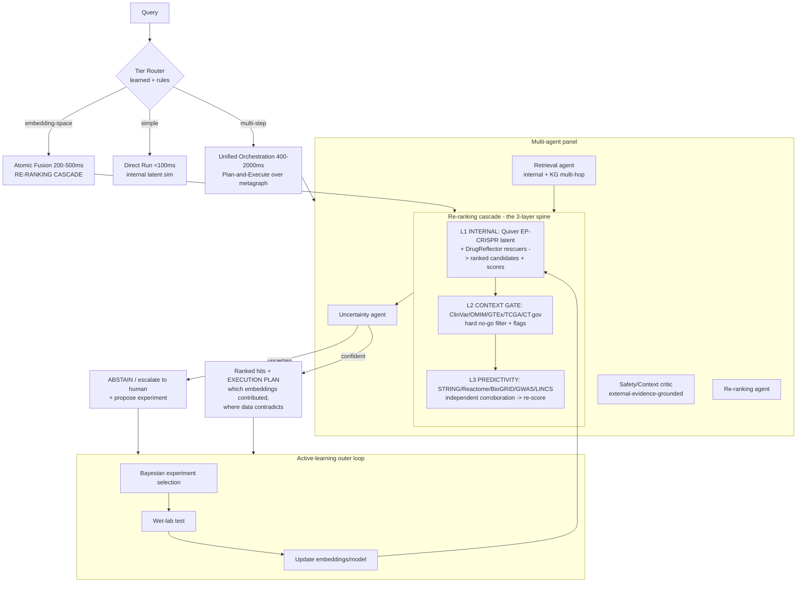

# Orchestration for Sapphire v3: A Strategic Technical Brief

**To:** Hayes
**From:** (re: James' 2026-06-11 framing — "cutting-edge valid ways to use these tools, NOT Emit 2.0 with our data")
**Date:** 2026-06-15

---

## 0. TL;DR

James asked the right question and pre-empted the wrong answer. The wrong answer is "an agent that calls tools" — a generic ReAct loop wired to DrugBank, STRING, GTEx, etc. That is what Emit is, and a hundred other biomedical copilots. If we build that, our unique functional data becomes *just another tool the agent can call*, indistinguishable from a public API. We lose the moat by architecture.

The design principle that makes Sapphire different: **our internal latent space is the privileged reasoning substrate, and every external tool is an envelope around it — a context gate or a predictivity re-ranker, never a peer.** Orchestration is not "pick a tool"; it is "run the moat first, then let the world argue with the result."

This brief: (1) frames that design goal against the Emit-like baseline; (2) lays out four orchestration archetypes mapped to our existing three query tiers; (3) recommends a lead architecture — a **KG-grounded re-ranking cascade with an uncertainty-gated multi-agent panel and an active-learning loop**; (4) names what makes it novel; (5) gives a build sequence and an honest risk register. Quiver's culture is "state-of-the-art on shit is still shit," and our own evals back that: off-the-shelf foundation models (MAMMAL, ConPLex) are ~chance on single-target binder triage. The win is our data plus fine-tunes; externals enrich, they don't rescue.

---

## 1. The design goal — and the anti-pattern we are avoiding

The generic agentic pattern is **ReAct** ([Yao et al.; canonical loop](https://arxiv.org/html/2512.03560v1)): the LLM interleaves Thought → Action (tool call) → Observation, choosing tools opportunistically. It is the right default for open-ended assistants and it is exactly what a "Emit 2.0 with our data" build would be. Its structural problem for us is that it treats all knowledge sources symmetrically. The agent has no architectural reason to privilege the Quiver EP-CRISPR Atlas (104 pipelines, top source by 2x) over PubChem. Short-horizon, opportunistic, and source-agnostic — the opposite of the deliberate, internal-first reasoning our moat demands ([ReAct's "short-term thinking" weakness](https://dev.to/gabrielanhaia/react-plan-and-execute-or-reflection-the-three-agent-patterns-every-engineer-needs-in-2026-355p)).

The goal instead:

- **Internal data is the substrate, not a tool.** The first move on any discovery query is always a query against the fused multimodal latent embedding (oEP + CRISPR + DFP2 + transcriptomics → transformer/MLP → vector DB) and the DrugReflector-style rescuer ranking. That produces a *candidate hypothesis with a provenance*. Externals never produce the hypothesis; they only modify its standing.
- **External tools form a context/predictivity envelope.** Per the three-layer vision: Context sources (ClinVar, OMIM, GTEx, TCGA, ClinicalTrials.gov) **gate** ("great pain target but causes cancer = no-go"); Predictivity sources (STRING, Reactome, BioGRID, GWAS Catalog, LINCS/CMap) **re-rank** ("#7 by us, independently corroborated → #1"). This is a directed asymmetry the orchestration must enforce, not a flat tool menu.
- **Never leak the moat.** Functional EP traces never feed an external model; that modality stays internal permanently. Orchestration must make that a hard boundary, not a guideline.

---

## 2. Four orchestration archetypes (with tradeoffs and tier mapping)

Sapphire v3 already exposes three query tiers — **Direct Run** (<100ms, simple similarity), **Atomic Fusion** (200–500ms, user-driven embedding-space selection), **Unified Orchestration** (400–2000ms, multi-step metagraph plan discovery). The archetypes below are not alternatives to that model; they are *what fills the Unified Orchestration tier* (and partly Atomic Fusion).

### Archetype A — KG-grounded plan-and-execute over the Neo4j metagraph

A **planner** LLM compiles the query into an explicit multi-step plan against the metagraph (1.8M nodes / 17.9M edges); cheap executors run each step (graph traversal, vector lookup, tool call) ([plan-and-execute: plan upfront, cheap executor, good for dependent multi-step tasks](https://dev.to/gabrielanhaia/react-plan-and-execute-or-reflection-the-three-agent-patterns-every-engineer-needs-in-2026-355p)). The KG grounds reasoning so the LLM isn't free-associating: knowledge graphs "support multi-hop mechanistic reasoning and maintain persistent identifiers that simplify provenance tracking" ([biomedical KG-RAG](https://www.medrxiv.org/content/10.64898/2026.01.12.26343957v1.full)). Modern variants (Graph-R1, Think-on-Graph 2.0, CLAUSE) make traversal itself learned/agentic rather than fixed-hop ([agentic neuro-symbolic KG reasoning](https://arxiv.org/html/2509.21035v2)).

- **Pro:** deterministic, auditable plans → directly yields the *transparent execution plan* requirement. Multi-hop ("target → interacts with disease gene → in academic screen") is native.
- **Con:** planner latency and token cost; brittle if the plan is wrong upfront (no mid-course correction unless paired with reflection).
- **Tier:** the backbone of **Unified Orchestration**.

### Archetype B — Layered internal-first re-ranking cascade (operationalizes the 3-layer vision)

Not a planner — a **fixed pipeline** that encodes the three layers as stages: (1) Internal retrieval produces a ranked candidate set + scores from the latent space; (2) Context gate hard-filters/flags no-go candidates against safety/prevalence/competition; (3) Predictivity stage re-scores survivors using independent corroboration. This is a **non-predictive cascade** in routing terms — cheap-to-expensive stages, each pruning the set ([cascading models light-to-heavy](https://arxiv.org/pdf/2505.12601)).

- **Pro:** the asymmetry James wants is *structural*, not a prompt the LLM might ignore. Cheap, low-variance, easy to audit. Most queries never need a full LLM planner.
- **Con:** rigid; doesn't handle genuinely novel query shapes; the gate/boost logic must be carefully calibrated or it over-prunes good hits.
- **Tier:** fits **Atomic Fusion** for the common case; becomes a *callable sub-routine* inside Unified Orchestration.

### Archetype C — Multi-agent panel (retrieval / safety-critic / re-ranking / uncertainty)

Specialized agents deliberate: a **Retrieval agent** (internal latent + KG), a **Safety/Context critic** (the gate), a **Re-ranking agent** (predictivity), and an **Uncertainty agent** that abstains. Frameworks: LangGraph (directed graph + checkpointing, strongest production track record), AutoGen (conversational GroupChat), CrewAI (role-based) ([2025 framework comparison](https://medium.com/@hieutrantrung.it/the-ai-agent-framework-landscape-in-2025-what-changed-and-what-matters-3cd9b07ef2c3)). This mirrors recent drug-discovery multi-agent teams ([orchestrated knowledge-driven multi-agent therapeutic design](https://arxiv.org/pdf/2512.21623)).

- **Pro:** separation of concerns matches our layers cleanly; the critic adds adversarial safety review; naturally extensible.
- **Con:** token cost and latency multiply with agents; **a 2025 replication found single-model self-critique repeats its own misconceptions** ([Reflexion replication](https://dev.to/gabrielanhaia/react-plan-and-execute-or-reflection-the-three-agent-patterns-every-engineer-needs-in-2026-355p)) — the critic must use different evidence (external KG facts), not just re-prompt the same model. Risk of "collective hallucination" if agents aren't confidence-calibrated ([jury theorem for confidence-calibrated agents](https://arxiv.org/pdf/2602.22413)).
- **Tier:** the richest **Unified Orchestration** path; overkill for Direct Run / Atomic Fusion.

### Archetype D — Active-learning experimental-design loop (predict → test → update)

The closed loop is the part Emit structurally cannot have: agent proposes the highest-value experiment, wet-lab runs it, embeddings/model update. This is the "AI scientist / self-driving lab" pattern, where the defensible value is the loop itself, not the model ([self-driving labs as the moat](https://www.drugdiscoveryonline.com/doc/beyond-the-ai-scientist-building-defensible-value-with-self-driving-labs-0001)). **BioDiscoveryAgent showed 21% improvement over Bayesian-optimization baselines for genetic perturbation design** ([AI scientist survey](https://arxiv.org/html/2510.23045v3)) — directly our CRISPR-perturbation regime. Realistic target: **Level-3 autonomy** — the agent proposes and optimizes, humans set goals and make claim-worthy calls ([most 2025 autonomous labs are Level 3](https://www.frontiersin.org/journals/artificial-intelligence/articles/10.3389/frai.2025.1649155/full)).

- **Pro:** compounds the moat — every cycle widens the data gap competitors can't close. Bayesian experimental design maximizes information per expensive assay.
- **Con:** slowest loop (days, not ms); not a query tier — an **outer loop wrapping all three tiers**; requires disciplined wet-lab integration and provenance.
- **Tier:** orthogonal — the meta-loop that updates the substrate all tiers read from.

---

## 3. Recommended architecture

**Lead with a KG-grounded re-ranking cascade (B as the spine) + an uncertainty-gated multi-agent panel (C) for hard queries, all sitting inside a plan-and-execute shell (A), wrapped by the active-learning loop (D).** Not four systems — one system where each archetype occupies the layer it's best at. Map to tiers: Direct Run = internal retrieval only; Atomic Fusion = cascade (B); Unified Orchestration = planner (A) dispatching the panel (C) over the cascade; the loop (D) updates the substrate underneath.

**The re-ranking cascade, concretely.** A candidate target carries a score vector through the stages:

1. **L1 (internal):** `s_internal` = latent-space rescuer score from the fused embedding. Produces the ordered list and the provenance (which of MODEX/ENS/PCA/LINCS/PLATINUM contributed). *Target X = rank #7.*
2. **L2 (context gate):** query ClinVar/OMIM/GTEx/TCGA/ClinicalTrials.gov. This stage can only **demote or kill**, never promote — a hard veto channel ("expressed in cardiac tissue + oncogenic in TCGA → no-go"). Output: `gate ∈ {pass, flag, no-go}`.
3. **L3 (predictivity boost):** for survivors, add corroboration mass from independent assays — GWAS hit on the disease gene, STRING/BioGRID PPI with the disease gene, Reactome co-pathway, LINCS/CMap antipodal signature. `s_final = f(s_internal, Σ corroboration)`. *Target X corroborated by an academic screen + PPI with the disease gene → re-ranked to #1.*

The gate (subtractive, safety) and the boost (additive, predictivity) are **separate channels with separate math** — exactly James' distinction between context and predictivity. Keep them separate so neither silently overrides the other.

**Where uncertainty/abstention lives.** A dedicated uncertainty agent sits at the cascade exit, before any answer is emitted. It implements **selective prediction**: calibrated confidence + a risk-controlled refusal threshold ([calibration + risk-controlled refusal framework](https://arxiv.org/pdf/2509.01455)). Signals it fuses: latent-space neighborhood density (sparse neighborhood = low confidence), context/predictivity *disagreement* (internal says yes, GWAS says nothing, ClinVar contradicts), and the model's own calibrated confidence. Hallucination is largely "rewarded guessing"; **granting credit for abstention measurably reduces it** ([I-CALM](https://arxiv.org/pdf/2604.03904), [abstention survey, TACL 2025](https://aclanthology.org/2025.findings-emnlp.679.pdf)). On abstain, Sapphire doesn't shrug — it routes to the active-learning loop and **proposes the experiment** that would resolve the uncertainty. Abstention becomes the trigger for discovery.

**How transparent execution plans are produced.** The plan is a byproduct of the architecture, not a post-hoc explanation: the plan-and-execute planner emits the step DAG; the KG traversal yields a provenance subgraph (which nodes/edges/persistent IDs were touched — KGs make provenance native); the cascade logs each stage's score delta and which embeddings/sources moved the rank; the uncertainty agent attaches the confidence and any contradiction it found. Render that as the user-facing execution plan: *which embeddings contributed, which external source gated or boosted, where the evidence contradicts.*

---

## 4. What makes this novel — not Emit 2.0

1. **Privileged internal latent space as substrate.** Reasoning starts inside a fused multimodal embedding (functional electrophysiology + CRISPR + DFP2 + transcriptomics) no external agent can reconstruct. Emit reasons over public knowledge; Sapphire reasons over a space that *is* the moat. Externals are an envelope, never a peer source.
2. **Explicit gate/boost cascade.** Context-as-veto and predictivity-as-re-rank are architecturally separate channels with separate math — directly operationalizing James' three layers. A generic agent flattens these into "tool calls"; we make the asymmetry load-bearing.
3. **Active-learning loop.** Predict → wet-lab test → update embeddings. The system gets *more* defensible with use ([self-driving lab as the durable moat](https://www.drugdiscoveryonline.com/doc/beyond-the-ai-scientist-building-defensible-value-with-self-driving-labs-0001); [21% over BO on perturbation design](https://arxiv.org/html/2510.23045v3)). Emit has no wet lab; it cannot close this loop.
4. **KG-grounded multi-hop reasoning.** Re-ranking rides on traversals over our 1.8M-node / 17.9M-edge metagraph (target → PPI → disease gene → academic screen), with provenance and contradiction surfaced ([KG multi-hop + provenance](https://www.medrxiv.org/content/10.64898/2026.01.12.26343957v1.full)). Not vector-similarity vibes — explicit, auditable mechanistic paths.

---

## 5. Build sequence and risks

**Sequence (lowest-risk, highest-leverage first):**

1. **Ship the cascade spine (Archetype B) over existing infra.** L1 already exists (latent + DrugReflector). Wire L2 gate (Tier-1 context: ClinVar, OMIM, GTEx, TCGA, ClinicalTrials.gov) and L3 boost (Tier-1 predictivity: STRING, Reactome, BioGRID, GWAS) into the Neo4j graph that already holds 1.8M nodes. This is the integration-map build priority #1 and delivers James' #7→#1 demo with no LLM planner. Lives in Atomic Fusion.
2. **Add the uncertainty/abstention gate.** Cheap, high-trust-payoff, gates everything downstream. Calibrate against held-out wet-lab outcomes.
3. **Add LINCS/CMap** (transcriptional corroboration, priority #2) to deepen L3.
4. **Wrap with plan-and-execute (A) for Unified Orchestration** — only for queries the cascade can't shape-match. Use LangGraph for checkpointed, auditable graphs.
5. **Layer the multi-agent panel (C)** for the hardest queries, with the safety critic grounded in *external KG evidence* (not self-critique).
6. **Close the active-learning loop (D)** last — Bayesian experiment selection feeding the existing predict→test→update cycle. Target Level-3 autonomy: humans own claim-worthy calls.

**Risks (honest):**

- **Cost/tokens.** Multi-agent and planner paths multiply LLM calls. Mitigation: the tier router keeps most traffic on cheap deterministic paths; reserve planner/panel for genuinely hard queries (intelligent routing buys ~85% cost reduction at ~95% performance — [routing economics](https://www.mindstudio.ai/blog/best-ai-model-routers-multi-provider-llm-cost-011e6)). A learned router can replace hand rules later, but **kNN/simple routers often beat complex learned ones** ([when simple beats learned](https://arxiv.org/pdf/2505.12601)) — start simple.
- **Hallucination / reliability.** Self-critique repeats its own errors ([Reflexion replication](https://dev.to/gabrielanhaia/react-plan-and-execute-or-reflection-the-three-agent-patterns-every-engineer-needs-in-2026-355p)); confidence-uncalibrated panels can collectively hallucinate ([jury theorem](https://arxiv.org/pdf/2602.22413)). Mitigation: ground every critic in external KG facts; enforce calibrated abstention; KG provenance makes fabrication visible.
- **Latency tiers.** Honor the existing budgets (<100ms / 200–500ms / 400–2000ms). The router must keep the planner/panel out of the fast tiers; pre-compute corroboration where possible. Routing itself adds ~50–100ms — acceptable only off the Direct Run path.
- **Humans in the loop.** Keep humans on the go/no-go gate decisions and all claim-worthy calls (Level-3, not Level-4). Abstention → human escalation → proposed experiment is the right default for a discovery system where a wrong "go" is expensive.
- **The empirical reality check.** Our own evals say off-the-shelf models are ~chance on single-target binder triage (MAMMAL, ConPLex), and RDKit fingerprints beat MAMMAL embeddings (Q-Mammal). "State-of-the-art on shit is still shit." So: do **not** stake the architecture on external foundation models doing the hard prediction. They are enrichment in L2/L3. The prediction comes from our data and our fine-tunes. Validate every stage on held-out wet-lab outcomes before trusting it in the cascade.

---

### Recommendation — 5 bullets

- **Build the three-layer re-ranking cascade as the spine** (internal latent → context **gate** → predictivity **boost**), with context (subtractive/veto) and predictivity (additive/re-rank) as architecturally separate channels — this *is* James' #7→#1 demo and reuses infra we already have.
- **Make internal data the privileged substrate, not a tool**; externals form a context/predictivity envelope around it — the one decision that structurally distinguishes us from an Emit-like generic agent.
- **Put a calibrated uncertainty/abstention gate at the cascade exit**: on low confidence or internal-vs-external contradiction, abstain and *propose the experiment* rather than guess.
- **Map archetypes to the existing tiers** — cascade in Atomic Fusion, plan-and-execute + multi-agent panel in Unified Orchestration, internal-only in Direct Run — and route most traffic to cheap deterministic paths to control cost/latency.
- **Close the predict→test→update active-learning loop** (Level-3 autonomy, humans own go/no-go) — the moat Emit structurally can't replicate; don't bet the architecture on off-the-shelf foundation models, which our evals show are ~chance on the hard tasks.
