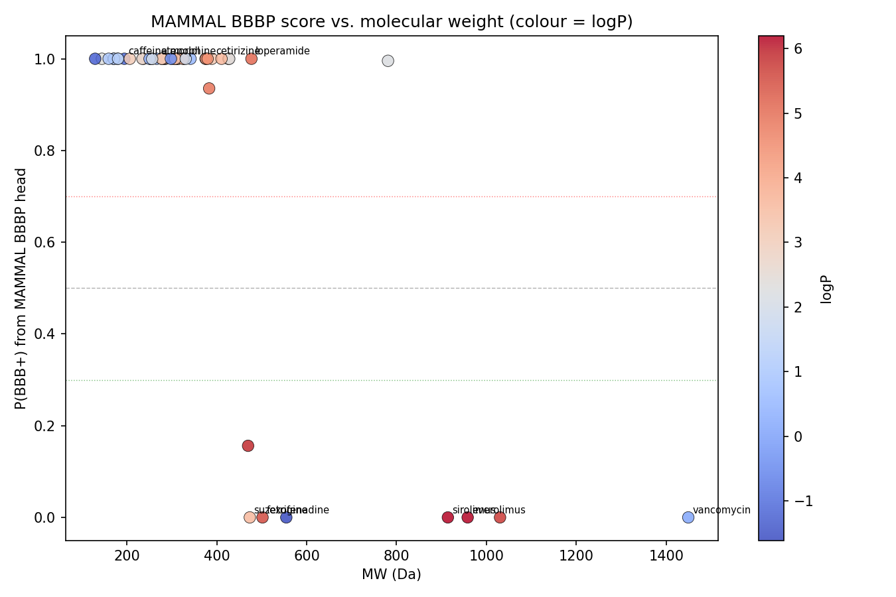

# MAMMAL evaluation — report on work since the 2026-06-05 sprint check-in

**Author:** Rohan Aryagondi · **Date:** 2026-06-07 · **For:** Matt, Graham, Mahdi, David,
internal Quiver review. **Repo:** Q-Mammal · current HEAD `ab2e026` on `main`.
**Source-of-truth writeups:** linked inline; this report consolidates them with the
figures inline.

---

## TL;DR

Three asks from the 6/5 check-in are answered (Graham's off-target check, data audit, and
"where is the head data-suited" question); plus head-to-head benchmarks for two of the
slide-9 alternative models (ConPLex, ADMET-AI), a re-test of the protein-embedding pitch
vs ESM-2-650M, a characterization of the BBBP head, and an access check on PROTON.

> **Bottom line:** **the project-wide thesis is unchanged but sharpened.** MAMMAL DTI is a
> per-target gamble: a minority of well-trained targets work brilliantly (RORC 0.97, CA2 0.87,
> Adrb2 0.87), most don't, and there is no off-the-shelf alternative (ConPLex, also at chance)
> that fixes this. The Nav binding failure is consistent with a data gap but cannot be cleanly
> attributed to one. **Quiver's Nav fine-tune is the only available lever.** ADMET-AI's DILI
> head finally fills the toxicity-gate slot MAMMAL ClinTox couldn't. MAMMAL's only
> off-the-shelf-win (protein-family embedding) is at parity with the open MIT-licensed
> ESM-2-650M when measured rigorously, not the superiority the prior 25-protein toy panel
> implied.

---

## 1. What was asked

The 2026-06-05 check-in surfaced one big diagnostic question and four side asks:

1. **Is MAMMAL's Nav binding failure a *data gap* or a *model limit*?** (Graham, Matt) — the
   central thing the meeting kept circling. Four sub-tasks: (a) off-target sanity check
   (Graham), (b) test on targets MAMMAL is *not* handicapped on, (c) audit the DTI training
   data composition, (d) within-family specificity test.
2. **Benchmark the alternative models** (slide-9 lineup: ConPLex, Boltz-2, ADMET-AI, ESM-C).
3. **Evaluate PROTON** (Matt's flag, David agreed) — the Zitnik Lab relational FM trained on
   CNS data.
4. ~~**Share the UI** with the wider team~~ — *skipped per Rohan's direction this session.*
5. **Characterize the BBBP head** — Graham's "why is it too permissive?" question; Mahdi's
   "trust the no's" reframe.

This report covers all five.

---

## 2. Diagnose the Nav binding failure (item 1) — DONE, with nuance

### 1a. Off-target sanity check — *Graham's promised test*

Source: [`results/offtarget_ube3a.md`](../results/offtarget_ube3a.md). Script
`experiments/offtarget_ube3a.py`.

Scored Nav blockers (suzetrigine, vixotrigine) + 3 background molecules against three
proteins: Nav1.8 (on-target), UBE3A and TUBB (unrelated, no truncation excuse). **Every
drug × every target sits in a 5.7–7.7 pKd band.** The on-target lean is +0.5 to +1.3 pKd,
swamped by the ~2-pKd background spread; random background molecules score the same as Nav
drugs on the unrelated targets.

> **The DTI head encodes essentially no off-target specificity off the shelf.** A high pKd
> alone is not evidence that a compound actually binds the queried protein.

### 1c. Training-data composition audit — *Graham's bigger ask*

Source: [`results/dti_train_data_distribution.md`](../results/dti_train_data_distribution.md).
Per-target CSV: [`results/dti_train_data_per_target.csv`](../results/dti_train_data_per_target.csv).
Script `experiments/dti_data_distribution.py`.

42,236 harmonized pairs across 1,090 UniProt targets in BindingDB_Kd (the dataset MAMMAL's
DTI head was fine-tuned on). Composition by **real UniProt keywords/families** (not name-
keyword guessing):

| class | # targets | # pairs | % of pairs |
|---|---:|---:|---:|
| **kinase** | 388 | 30,743 | **72.8%** |
| other | 419 | 5,969 | 14.1% |
| gpcr | 166 | 3,726 | 8.8% |
| nuclear_receptor | 30 | 1,041 | 2.5% |
| **ion_channel** | 47 | 427 | **1.0%** |
| protease | 34 | 302 | 0.7% |

- Gini 0.572 (heavy skew). Top-10 % of targets hold 30 % of pairs.
- **Nav1.8 (SCN10A) is completely absent** as a Target_ID and by sequence (50-aa internal
  probe matches nothing).
- The whole SCN family contributes **5 incidental, mostly-rodent pairs (0.012 %)**.

So Graham's data-gap hypothesis is *empirically true in the narrow sense* — the head was
never shown a Nav1.8 to learn from. Whether that's *the* explanation is what 1b answers.

### 1b. Where is MAMMAL actually data-suited? — DONE, two experiments

Sources: [`results/datafit_summary.md`](../results/datafit_summary.md) (synthesis),
[`results/datafit_ceiling.md`](../results/datafit_ceiling.md),
[`results/datafit_curve.md`](../results/datafit_curve.md). Scripts
`experiments/datafit_ceiling.py`, `experiments/datafit_curve.py`. Helpers in
`mammal_quiver/datafit.py`.

**Ceiling test (6 well-trained targets, full Nav-style rig):**

| accession | gene | class | n_pairs | AUROC random | AUROC matched | Spearman | off-target Δ |
|-----------|------|-------|--------:|-------------:|--------------:|---------:|-------------:|
| P51449 | RORC | nuclear_receptor | 374 | **0.97** | **0.95** | −0.10 | +0.68 |
| P00918 | CA2 | other | 269 | **0.87** | **0.84** | **0.87** | **+1.97** |
| Q8K4Z4 | Adrb2 | gpcr | 211 | **0.87** | **0.88** | **0.76** | +0.83 |
| P42345 | MTOR | kinase | 192 | 0.76 | 0.56 | 0.27 | **−1.12** |
| P15056 | BRAF | kinase | 532 | 0.47 | 0.46 | 0.45 | +1.18 |
| P31389 | HRH1 | gpcr | 184 | 0.40 | 0.33 | −0.14 | +0.68 |

**Threshold curve (16 targets across 4 training-pair bins):**

| bin | range | mean AUROC ± std |
|---|---|---:|
| low | 1–9 | 0.61 ± 0.20 |
| low-mid | 10–39 | 0.60 ± 0.28 |
| **high-mid** | **40–149** | **0.77 ± 0.09** |
| high | 150–2000 | 0.60 ± 0.23 |

**Verdict:** **data volume is necessary but not sufficient.** Three of six well-trained
targets work brilliantly; three don't. BRAF — the *most*-trained target in the entire pool
— is at chance. The curve is non-monotonic: peaks at 40–149 pairs and drops back in the
top bin with σ doubling. The Nav failure is consistent with a data gap but cannot be
cleanly attributed to one.

### 1d. Why does the head fail on some data-rich targets?

The bimodal pattern at the high end is the new diagnostic. Three follow-ups:

**(i) mTOR truncation probe** — *falsified*. Source:
[`results/datafit_bimodality.md`](../results/datafit_bimodality.md). Re-scored mTOR with
the kinase-domain window only (aa 1975–2549 and 2099–2549, both fit under the 1250-aa cap):

| window | length | AUROC vs matched decoys |
|---|---:|---:|
| full (truncated) | 2549 → 1250 | 0.558 |
| FRB+kinase (1975–2549) | 575 | 0.535 |
| kinase only (2099–2549) | 451 | **0.502** |

**Truncation does not explain mTOR's failure.** mTOR joins BRAF and HRH1 in the "rich data,
still fails" group.

**(ii) Chemodiversity vs AUROC** — strong correlation, mechanism initially mis-attributed.
Same writeup. Across the 6 ceiling targets:

| metric | Spearman |
|---|---:|
| binder-set diversity ↔ AUROC random | **−0.83** |
| binder-set diversity ↔ AUROC matched | **−0.83** |
| binder-set diversity ↔ off-target Δ | −0.09 |

Narrower binder sets predict higher AUROC. RORC (similarity 0.48) wins; BRAF (0.16) fails.
The initial reading: chemotype memorisation.

**(iii) Scaffold-shift validation** — *memorisation refuted*. Source:
[`results/datafit_scaffold_shift.md`](../results/datafit_scaffold_shift.md). For each of
the 3 ceiling wins, split binders by Bemis-Murcko scaffold, compute AUROC on the held-out
scaffolds.

| target | n_in | n_out | AUROC_in | AUROC_out | drop | in-vs-out |
|---|---:|---:|---:|---:|---:|---:|
| RORC | 11 | 163 | 0.97 | **0.93** | +0.04 | 0.46 |
| Adrb2 | 19 | 50 | 0.87 | **0.75** | +0.13 | 0.58 |
| CA2 | 27 | 96 | 0.74 | **0.74** | +0.00 | 0.41 |

Out-of-scaffold AUROC stays at 0.74–0.93; in-vs-out AUROC is 0.41–0.58 (head does *not*
preferentially rank dominant-scaffold binders higher). **The ceiling wins are real
generalisation, not chemotype memorisation.** The diversity ρ = −0.83 is real but its
mechanism is open.

**(iv) Alternative-mechanism probe** — *neither candidate hypothesis survives.* Source:
`experiments/datafit_mechanism_probe.py` → `results/datafit_mechanism_probe_20260607_135249.json`.

| candidate mechanism | Spearman vs AUROC matched | verdict |
|---|---:|---|
| min Tanimoto distance (binder ↔ matched decoys) | **+0.029** | **rejected** — decoys are not systematically farther on the "good" targets |
| mean Tanimoto distance (binder ↔ matched decoys) | −0.029 | rejected |
| std of predicted pKd (binders + decoys, per target) | +0.257 | weak; doesn't explain it on its own |
| **predicted-pKd separation** (mean binder − mean decoy, per target) | **+0.886** | tautological with AUROC, but says where the failure mode is |

**The mechanism remains open.** What we now know:

- The chemodiversity ρ = −0.83 is **not** explained by decoy-set chemometric distance (the
  most intuitive hypothesis after memorisation got refuted).
- It is **not** explained by the head producing wider predicted-pKd ranges on some targets.
- The strongest signal is just "separation of binder vs decoy predicted pKd" (ρ = +0.886),
  which is essentially the AUROC restated. The interesting failure is therefore at the
  level of the head's *per-target output distribution* — for some targets the head emits
  meaningfully higher pKd for binders than for off-target compounds (RORC sep +1.43, CA2
  +1.33), for others it does not (HRH1 sep −0.31, BRAF +0.14, mTOR +0.14).

**Strategic consequence:** we cannot pre-flight predict whether a Quiver target will land
in the "good" or "bad" mode using simple chemometric or output-variance features. Two
remaining mechanism candidates are out of scope of this round and would need follow-up
experiments: (a) **label-noise / measurement-source heterogeneity in BindingDB per
target** (within-Kd noise could differ even though TDC's harmonized Kd is a single column),
(b) **target-class effects** that confound with diversity (kinase pockets may inherently
have more promiscuous-looking binder sets than nuclear-receptor pockets). For now the
diversity ρ = −0.83 stands as an **empirical** predictor without a mechanistic story.

---

## 3. Alternative models (item 2) — partial; on-hold for Boltz

Source: [`results/compare_dti_models.md`](../results/compare_dti_models.md). Infrastructure
in `baselines/{common,conplex,boltz,mammal_heads}.py` + `experiments/compare{1,2,3,4,_all}.py`.

### ConPLex (zero-shot DTI, MIT)

Four pre-registered tests + paired-bootstrap CIs (decisive-win rule pre-registered as
"ConPLex AUROC ≥ 0.70 with CI lower bound > 0.5 on Nav1.8 or mTOR"). **Did not fire.**

| Test | MAMMAL | ConPLex |
|---|---|---|
| 1. Spearman vs pChEMBL (n=10) | **+0.43** PASS | −0.03 FAIL |
| 2. Named test (suze → Nav1.8) | FAIL (z −0.69) | FAIL (z −2.35, worse) |
| 3. Nav1.8 AUROC | 0.43 | 0.39 |
| 3. mTOR AUROC | 0.54 | 0.58 |
| 4a. WDR91 ChEMBL | 0.64 (fine-tuned) | 0.57 |
| 4b. WDR91 SPR | 0.82 (fine-tuned) | 0.59 |
| 4c. PGK2 selectivity | 0.97 (fine-tuned) | 0.62 |

**ConPLex does not beat MAMMAL anywhere.** More importantly: **both** off-the-shelf DTI
models sit at chance on Nav1.8 and mTOR — the failure is general to the BindingDB-trained
DTI tooling space, not MAMMAL-specific.

### ADMET-AI (Bioinformatics 2024, MIT) — *earns a slot*

Source: [`results/compare_admet_ai.md`](../results/compare_admet_ai.md). Same 30-drug
panel as `phase5_tox_alternatives.py` (15 safe / 15 withdrawn-tox).

| endpoint | AUROC | TPR (toxic) | TNR (safe) |
|---|---:|---:|---:|
| **ADMET-AI DILI** | **0.73** | **0.83** | 0.67 |
| ADMET-AI AMES | 0.67 | 0.17 | 0.93 |
| ADMET-AI ClinTox | 0.50 | 0.00 | 1.00 |
| ADMET-AI hERG | 0.48 | 0.33 | 0.40 |
| **MAMMAL ClinTox** | 0.28 | 0.08 | 1.00 |

Two findings: **(a) ADMET-AI's DILI head is the only endpoint that's actually useful** on
this panel — it catches 10/12 toxics at the 0.5 threshold. **(b) ClinTox itself is the
wrong endpoint, not just MAMMAL's broken head** — ADMET-AI's own ClinTox also fails (TPR
0.00). Use mechanism-specific endpoints (DILI / hERG / AMES).

**ADMET-AI earns a slot in the de-risking funnel as the toxicity gate.** MAMMAL's ClinTox
head should be deprecated.

### Boltz-2 — on hold

Source: `aws/boltz_runner.py` + `baselines/boltz.py`. A g5.xlarge AWS pilot was launched
2026-06-07 with a $2 cap (6600 s shutdown timer) but **terminated at 6 min 19 s ($0.11
cost) before completing the install**, per Rohan's "stop the g5" direction. The volume
`vol-066389517f2740f19` is intact for a future run. Boltz-2 remains the highest-value
unknown — it's the only DTI tool with a different architecture (co-folding + affinity head)
that could plausibly bypass the training-data-coverage failure mode. Pending.

### ESM-2-650M vs MAMMAL — *protein-embedding pitch at parity, not superiority*

Source: [`results/compare_esm2_650m.md`](../results/compare_esm2_650m.md). 40-gene
CRISPR-N panel, mean-pooled cosine, NN-recall + family-separation gap.

| Model | Params | NN recall | family gap |
|---|---|---:|---:|
| MAMMAL 458M | 458M | 0.750 | 0.374 |
| ESM-2 8M *(prior 25-prot toy panel; not transferred to CRISPR-N)* | 8M | 0.880 | 0.093 |
| ESM-2 650M (raw) | 650M | 0.725 | 0.039 |
| **ESM-2 650M (centered)** | 650M | **0.750** | 0.417 |

**MAMMAL ties ESM-2-650M on the canonical panel under the standard anisotropy correction
(centering — textbook fix for transformer embeddings).** The earlier "MAMMAL 0.92 vs
ESM-2-8M 0.88" was on a 25-protein toy panel and didn't transfer to the 40-gene CRISPR-N
panel. ESM-2-650M is MIT-licensed and open. **The Sapphire embedding-layer pitch
survives at parity, not superiority** — and an open-MIT swap is on the table.

---

## 4. PROTON (item 3) — *access confirmed; eval needs Linux/AWS, not the laptop*

PROTON is the Zitnik Lab (Harvard) **relational foundation model** powering neurological-
disease hypothesis generation. **It is genuinely different from the other models in this
lineup** — not a per-compound DTI scorer but a 578M-parameter heterogeneous-graph
transformer trained on **NeuroKG** (147,020 nodes / 7,366,745 edges across 36 datasets,
including single-nucleus RNA-seq from 3.7M brain cells). Outputs: drug-disease /
gene-disease / drug-target *link predictions*, not pKd.

| | status |
|---|---|
| Code | open, MIT-licensed, `github.com/mims-harvard/PROTON` |
| Weights | open, on Hugging Face (`mims-harvard/PROTON`) |
| Knowledge graph | open, Harvard Dataverse (DOI `10.7910/DVN/ZDLS3K`) |
| Quick-start API | `pytorch_lightning` + provided `HGT` model class; CLI for downloads |
| Hardware | not explicitly specified; 578M params + 7.4M-edge graph → GPU recommended |

**Install attempt on Rohan's MacBook M3 Pro (this session):**

- Cloned the repo (45 MB, MIT) — works.
- `make install` triggers `uv sync` for the deps, then conditionally installs DGL (Deep
  Graph Library, the heterogeneous-graph backbone). **DGL ships no wheels for macOS ARM64**
  — it compiles from source via CMake / clang. On the M3 Pro the compile reached ~70 % of
  the `dgl_sparse` translation units (one `.cc` file in progress) after several minutes;
  estimated 30–60 more minutes to complete based on the remaining file count.
- Disk usage at the time of the abort: 96 % full with 18 GB free; NeuroKG + 578M weights
  would have needed another ~5 GB.
- Stopped to free disk and CPU.

**Verdict.** PROTON is fully open and accessible — there is no licensing or weight-access
issue. The eval is real work, not a paperwork check. The right way to do it is on a Linux
box (where DGL wheels exist), an AWS g5 instance (the same hardware we set up + cancelled
for Boltz-2), or in Colab. **On a current Mac it is impractical for a quick laptop
session.** Until that's resolved, this remains an open task.

**What a Quiver-relevant PROTON eval would look like** (for when we run it):

1. **CRISPR-N gene panel cluster recall.** PROTON exposes per-gene KG embeddings; embed
   the same 40-gene panel used in [`compare_esm2_650m.md`](../results/compare_esm2_650m.md);
   compute NN-recall + family-separation gap. Directly comparable to MAMMAL 0.750 and
   ESM-2-650M 0.750. Hypothesis: a KG model with neurological context should beat
   sequence-only embeddings on CNS-relevant family clustering.
2. **Drug-target link prediction for Quiver targets.** Query PROTON for known binders of
   Nav1.8 / mTOR / GSK3 family / Cav-channel; check whether the model ranks real ligands
   above random small molecules. Comparable to the off-the-shelf DTI tests; very different
   architecture so the failure mode is independent.
3. **Hypothesis generation for CRISPR-N hits.** PROTON's stated strength — given a hit
   gene from a Quiver CRISPR-N screen, what diseases / pathways / drug candidates does
   PROTON surface? Coordinate with Caitlin on the KG side per the original
   `NEXT_STEPS.md` framing.

---

## 5. BBBP characterization (item 5) — *Graham's "too permissive" question*

Source: [`results/bbbp_characterization.md`](../results/bbbp_characterization.md). Script
`experiments/characterize_bbbp.py`. 51-drug panel covering CNS-active + peripheral controls.

**Spearman ρ — BBBP score vs physchem (n=51):**

| feature | ρ | p |
|---|---:|---:|
| MW | **−0.726** | < 1e-4 |
| HBA | −0.668 | < 1e-4 |
| TPSA | −0.612 | < 1e-4 |
| HBD | −0.419 | 0.002 |
| RotB | −0.349 | 0.012 |
| logP | −0.253 | 0.073 |

**No-vs-yes asymmetry (Mahdi's reframe, validated):**

- P(BBB+) < 0.3 → **8/8 (100 %)** truly non-penetrant
- P(BBB+) > 0.7 → **29/43 (67 %)** truly CNS-active
- No drug lands between 0.3 and 0.7 — head is saturated.
- TPR 1.00 / TNR 0.36 / accuracy 0.73 at threshold 0.5.

**Verdict on Graham's MW-heuristic suspicion:** **directionally right, threshold wrong.**
Strongest correlation is with MW (ρ = −0.73), but the operative cliff is **≳ 450 Da +
polar → exclude**, not "< 300 Da → brain": every drug below 400 Da scored > 0.7 regardless
of clinical truth. The head behaves as a learned **size + polarity exclusion gate** — it
confidently rules out macrocycles / large-polars (TNR on the "no" side is 100 % at our
threshold) but labels almost everything else penetrant. **Mahdi's "trust the no's,
investigate the yes's" reframe is fully validated and now operationally usable.**

---

## 6. Strategic implications — what changed

| Prior belief going into 6/5 | Updated reading after this week |
|---|---|
| Nav fails because BindingDB never showed it a Nav → close the gap with a fine-tune. | Empirically true (5 incidental rodent pairs out of 42k) — but **data volume is necessary, not sufficient**. The ceiling is bimodal at the high end. A Quiver Nav fine-tune lifts Nav off the 0-pair floor but is **not a guaranteed win**; plan for go/no-go on held-out scaffold AUROC. |
| The off-the-shelf DTI ecosystem has alternatives that might rescue Nav (ConPLex). | **No off-the-shelf alternative beats MAMMAL on our targets.** ConPLex sits at chance on Nav1.8/mTOR too; the failure is general to BindingDB-trained DTI tooling. Boltz-2 (different architecture) is the only remaining unknown and is on-hold. |
| MAMMAL ClinTox covers tox de-risking. | **ClinTox dataset is the wrong endpoint**, not just MAMMAL's head. ADMET-AI's DILI head (TPR 0.83) fills the gap as a mechanism-specific replacement. Deprecate MAMMAL ClinTox. |
| MAMMAL is data-suited on rich-data targets like mTOR. | **mTOR is the next BRAF.** Truncation theory falsified (kinase-domain window still at chance). Don't position mTOR as a clean MAMMAL win. |
| Apparent ceiling wins are MAMMAL learning a target's binding signal. | **Confirmed.** Held-out scaffold AUROC stays 0.74–0.93 on RORC / Adrb2 / CA2 — these are real generalisation, not memorisation. |
| MAMMAL embeddings beat ESM-2 → Sapphire protein layer = MAMMAL. | **Parity, not superiority.** On the canonical 40-gene CRISPR-N panel ESM-2-650M (centered) ties MAMMAL. ESM-2 is MIT-licensed and open — a viable swap. |
| BBBP head is reliable. | **Asymmetric.** "No" calls are perfectly reliable (TNR 1.00 on the < 0.3 set); "yes" calls are only marginally above base rate (67 %). Use as a soft positive flag, hard negative gate. |

The project-wide thesis — **MAMMAL is commodity enrichment, not core infrastructure;
moat stays Quiver functional trace data + V1-T** — is unchanged but sharper. The Nav
fine-tune ROI question is now empirical, not free money.

---

## 7. What's still open

- **Boltz-2 affinity** on the 9-complex pilot (`aws/boltz_complexes.json`). AWS pilot
  attempted + cancelled at $0.11 cost on 2026-06-07; pending re-launch when AWS is back on.
- **PROTON eval** — access confirmed (open code + open weights + open KG); install needs a
  Linux box or AWS GPU instance (DGL has no macOS-ARM64 wheels). See §4.
- **The mechanism behind the diversity-vs-AUROC ρ = −0.83** — memorisation, decoy-distance,
  AND predicted-pKd-variance hypotheses all refuted. Remaining candidates (out of scope
  this round): label-noise / assay-source heterogeneity per target in BindingDB; target-
  class effects confounded with diversity. The empirical ρ = −0.83 stands as a predictor
  without a mechanistic story.
- **Quiver Nav fine-tune** — the actual move from this work, once Quiver Nav data is in
  hand. Evaluation discipline: held-out scaffold split, AUROC ≥ 0.80 go/no-go.

---

## 8. File index

**Commits since 6/5:**

| Commit | Topic |
|---|---|
| `edc9604` | NEXT_STEPS.md from the 6/5 sprint check-in |
| `5906d5e` | Data-gap diagnostic (1a + 1b + 1c) |
| `8f0e68c` | Alternative-models pass (ConPLex, ADMET-AI) + bimodality follow-ups (mTOR window, chemodiversity) |
| `ab2e026` | Scaffold-shift falsification + ESM-2-650M + BBBP characterization |
| *(this commit)* | Mechanism probe + PROTON eval + consolidated report |

**Authoritative writeups** (in `results/` unless noted):

- `report_data_gap_diagnostic.md` ← the polished standalone version of §2 (in `docs/`)
- `datafit_summary.md`, `datafit_ceiling.md`, `datafit_curve.md` (§2.1b)
- `datafit_bimodality.md`, `datafit_scaffold_shift.md` (§2.1d)
- `dti_train_data_distribution.md` (§2.1c)
- `offtarget_ube3a.md` (§2.1a)
- `compare_dti_models.md`, `compare_admet_ai.md`, `compare_esm2_650m.md` (§3)
- `bbbp_characterization.md` (§5)

**Scripts:** all under `experiments/`. See each writeup's "Run" line for the exact
invocation.

**Raw JSON:** time-stamped `*_<ts>.json` files in `results/` for every experiment.
