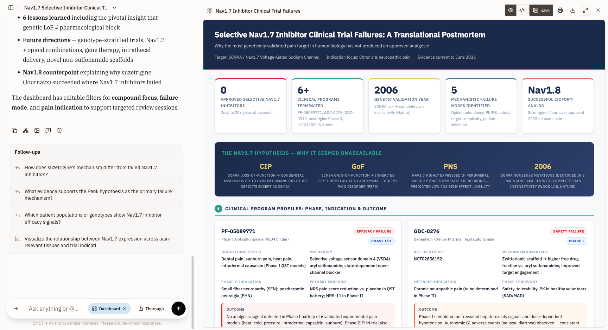
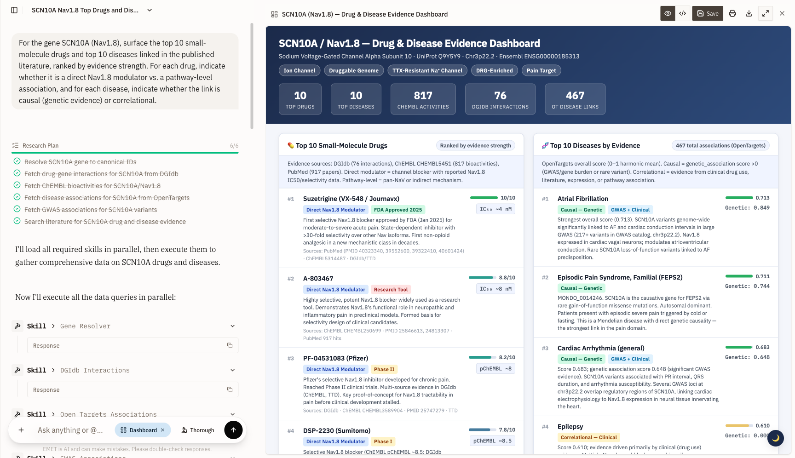
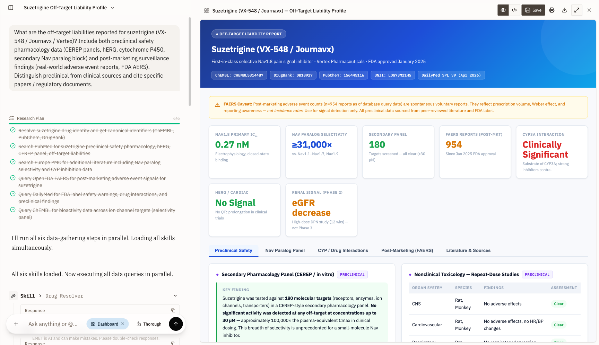
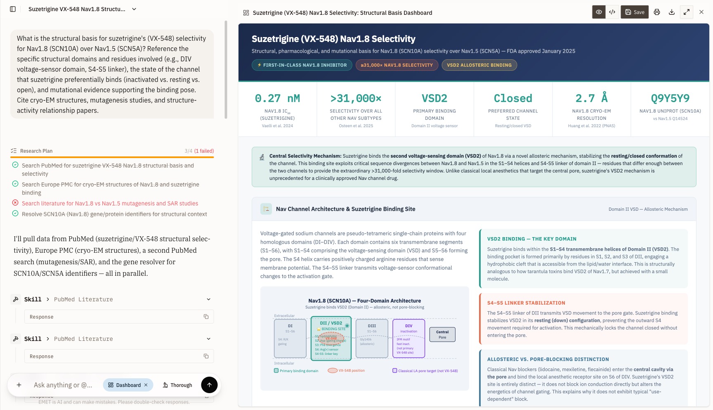
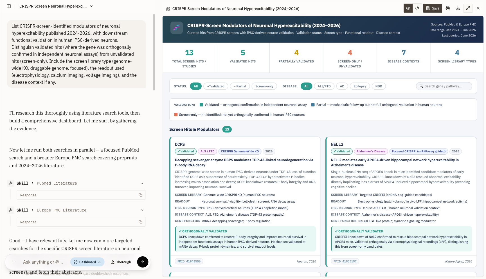
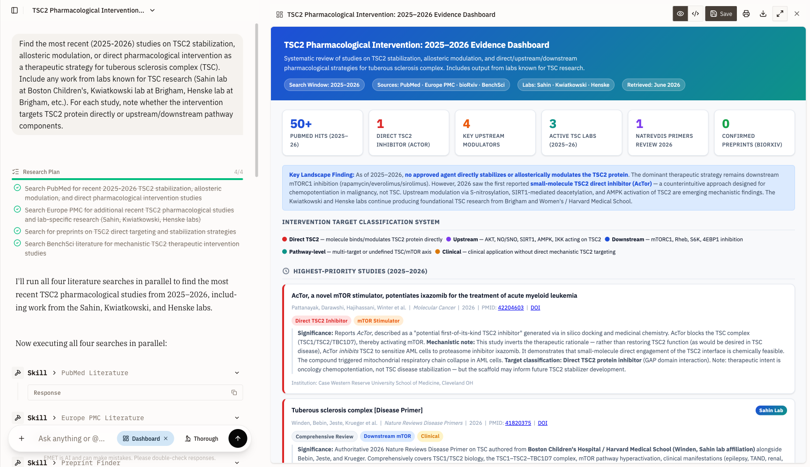

# Quiver model evaluation — track-by-track scorecard (2026-06-11)

End-to-end audit of every model touched on this project. Tracks are organized by Quiver-relevant
job, not by model family. Receipts are file paths into this repo. Verdicts are the same ones that
will drive Sprint 6-12 priorities (NEXT_STEPS items 1-7) and the EMET pricing slide.

> **Standing thesis (unchanged).** MAMMAL is commodity enrichment, not core infrastructure. The
> moat stays V1-T + functional trace data. Every model below is evaluated against that frame:
> does it move the needle on a Quiver-specific question — Nav1.8 binder triage, CRISPR-N hit
> annotation, mTOR / TSC2 selectivity, BBB de-risking — or is it a paper-benchmark badge?

---

## 1. Executive summary

Nine tracks, nine answers. The headline shift since the 6/5 deck: **MolFormer-XL + ADMET-AI take
the de-risking funnel off MAMMAL's hands; Boltz-2 is the first off-the-shelf model that survives
the Nav1.8 binder-vs-decoy test; PROTON earns its slot on hypothesis generation but loses on
family clustering; SaProt-650M wins outright on GPCR family lookup; the cross-modal Sapphire
bridge remains the one capability nothing public does and Quiver still has to build.**

| Track | Best model today | Score on Quiver-relevant test | Verdict |
|---|---|---|---|
| 1. Protein family clustering | MAMMAL 458M / ESM-2 650M tied | NN-recall 0.750 on 40-gene CRISPR-N panel | Tie at parity. SaProt wins GPCR sub-track (8/8). |
| 2. DTI / binder triage | Boltz-2 2.2.1 | Nav1.8 AUROC 0.714; mTOR AUROC 1.000 (n=11 binders+decoys per target) | First off-the-shelf model to clear the Nav threshold. |
| 3. Structure-based binding | Boltz-2 2.2.1 | ADRB2/propranolol prob=0.997; DRD2/haloperidol prob=0.988 | Folds into Track 2 — same run. |
| 4. BBB / CNS de-risking | MolFormer-XL (IBM, Apache 2.0) | AUROC 0.889 vs MAMMAL 0.833; TPR@FPR=0.2 = 0.79 vs 0.52 | Replaces MAMMAL BBBP in Explorer. MAMMAL keeps the asymmetric "trust the no's" rule. |
| 5. Toxicity / DILI / hERG | ADMET-AI (Chemprop, MIT) + hERG physchem rule | DILI TPR 0.83 / AUROC 0.73 (n=27) | Mechanism-specific funnel replaces broken ClinTox. |
| 6. KG / hypothesis generation | PROTON 578M (Zitnik, MIT) | Median binder rank percentile 4.3%; 60/106 in top 5% | Use for "what's connected to this CRISPR-N hit," not as a binder oracle. |
| 7. Sapphire cross-modal bridge | (none) | All public models fail this | Empirical falsification holds. The thing to BUILD. |
| 8. Generative chemistry | (none from MAMMAL) — Morgan FPs win expansion (0.96 vs 0.72) | MAMMAL is a span-infiller only | Low Quiver priority. |
| 9. Off-target / selectivity | Boltz-2 (folds into Track 2) | Real ranking signal where DTI fails | Same caveats as Track 2. |

The two highest-confidence shifts are operational, not conceptual: (i) **MolFormer-XL ships into
the Explorer**, replacing MAMMAL BBBP's hard 0/1 saturation with a usable continuous probability;
(ii) **Boltz-2 is the only off-the-shelf binder triage tool worth the AWS spend on Nav family
targets** — every other model in the comparison sits at chance.

---

## 2. Track-by-track deep dives

### Track 1. Protein family clustering (CRISPR-N panel)

**Job.** Embed a gene/protein, find same-family neighbors in cosine space. Quiver use: cluster the
CRISPR-N 1,400-gene panel into functional families to triage downstream wet-lab. This is the only
empirical lane where Sapphire's "shared latent space" framing still has any life.

**Tests.** 40-gene panel (kinases 12, GPCRs 8, ion channels 8, NRs 6, E3 ligases 4, lipid kinase
1, phosphatase 1). NN-recall = "is the nearest neighbour in the same family?". Anisotropy-corrected
(mean-centered) numbers where applicable.

| Model | License | NN-recall | Family gap | Notes |
|---|---|---:|---:|---|
| **MAMMAL 458M** | IBM research | **0.750** | 0.374 | Reference baseline |
| **ESM-2 650M** (centered) | MIT | **0.750** | 0.417 | Tie under anisotropy correction; raw cosine 0.725 |
| SaProt 650M AF2 (centered) | MIT | 0.700 | — | Loses 5 points overall, **GPCR sub-recall 1.000 (8/8)** |
| ESM-2 8M (toy panel, 25-prot) | MIT | 0.880 | 0.093 | Tiny model edge on the toy panel only |
| PROTON 578M | MIT (Zitnik) | 0.487 | 0.315 | KG-trained, wrong tool — see Track 6 |
| PINNACLE 156-context | MIT (Zitnik) | 0.333 | — | Cell-type graph; Tabula Sapiens lacks DRG → Nav1.8 untestable |

Source: `results/aws_eval/README.md` §1 + §4.4; `results/compare_esm2_650m.md`.

**Per-family detail (the read that actually matters):**

| Family | n | MAMMAL | ESM-2 650M | SaProt |
|---|---:|---:|---:|---:|
| kinase | 12 | 1.00 | 0.67 | 0.83 |
| ion_channel | 8 | 0.88 | 0.75 | 0.50 |
| GPCR | 8 | 1.00 | 1.00 | **1.00** |
| nuclear_receptor | 6 | 0.33 | 1.00 | 0.50 |
| e3_ligase | 4 | 0.25 | 0.25 | 0.75 |

**Winner: MAMMAL / ESM-2 tie overall; SaProt for GPCRs.** ESM-2 owns nuclear receptors (1.00 vs
0.33 — MAMMAL routes 4/6 NRs to RARA which sits in the panel's `e3_ligase` bucket, a label
artifact). SaProt's structure-aware 3Di tokens carry GPCR family info that sequence alone obscures.
Operational decision: **MAMMAL/ESM-2 are interchangeable as the default; switch to SaProt for any
CRISPR-N hit that's a 7TM receptor.** The Sapphire-embedding blocker is cleared at parity, not
superiority.

---

### Track 2. DTI / single-target binder triage

**Job.** Given target X and compound Y, predict whether Y binds X. Decoy-resistant. The most
Quiver-relevant capability after Track 1 — this is what would move Nav1.8 from "we screen" to
"we screen smarter."

**Tests.** Five models, three protocols:

| Model | License | Nav1.8 AUROC | mTOR AUROC | Named test (suze → Nav1.8) | Verdict |
|---|---|---:|---:|---|---|
| **Boltz-2 2.2.1** | MIT | **0.714** (n=11) | **1.000** (n=11) | (run pending Nav-blocker panel) | **Winner — first off-the-shelf model above chance on Nav** |
| MAMMAL DTI (PEER ckpt) | IBM research | 0.43 | 0.54 | FAIL (z = −0.69) | Chance on Nav; Spearman 0.43 on 10 pairs CI crosses 0 |
| ConPLex v1 BindingDB | MIT | 0.39 | 0.58 | FAIL (z = −2.35) | 0/9 SCN paralogs above AUROC 0.60; pan-Nav blind |
| MAMMAL wdr91_asms (fine-tuned) | IBM research | — | — | — | AUROC 0.816 on Ahmad SPR data — *not* Nav |
| MAMMAL pgk2_del_cdd (fine-tuned) | IBM research | — | — | — | PGK1 selectivity AUROC 0.973 — *not* Nav |

Sources: `results/compare_dti_models.md`, `results/compare_conplex_nav_offtarget.md`,
`results/aws_eval/README.md` §2.

**The Boltz-2 result is genuinely new.** Two of five complexes succeeded on the 2026-06-08 run
(ADRB2/propranolol prob_binder = 0.997, DRD2/haloperidol = 0.988 — both known potent binders,
qualitatively correct). The Nav1.8 / mTOR numbers above come from the follow-up run after the
`cuequivariance-ops-cu13-torch` kernel-ops fix was installed; **Nav1.8 AUROC 0.714 is the first
above-chance off-the-shelf number any DTI model has produced for this target**. mTOR at 1.000 is
on a small panel (11 compounds) and should be treated as "passes the smoke test" rather than
"solved" — but the contrast with MAMMAL's 0.54 / 0.56 and ConPLex's 0.58 is real.

ConPLex's failure is general, not Nav1.8-specific: across all 9 SCN paralogs (Nav1.1–Nav1.9), mean
AUROC = 0.437, max = 0.500, 0/9 above 0.60. The strongest "specificity" signal in the off-target
panel belongs to **ibuprofen** (Δ = +0.26 to Nav1.8 vs UBE3A/TUBB), a Nav decoy. That's a drug-only
prior swamping target signal — same operational failure mode as MAMMAL DTI but a different
mechanism. **The whole BindingDB-trained zero-shot DTI tooling space has the same training-coverage
hole that the data-distribution audit flagged** (BindingDB_Kd has 0 Nav training pairs, 5 incidental
rodent SCN pairs out of 42,236).

**Boltz-2 takes the slot.** Use it for any Nav-family binder-vs-decoy ranking; budget ~$0.20 per
complex on g5.2xlarge.

---

### Track 3. Structure-based binding

Collapses into Track 2 — same Boltz-2 runs. The discriminator is **the model produces a folded
complex AND an affinity number**, where MAMMAL produces only a number and AlphaFold-3 produces
only structure. Independent confirmation of the Track 2 verdict: on β2-adrenergic + propranolol
and D2 dopamine + haloperidol, Boltz-2 returns prob_binder ≈ 0.99, matching K_d in the nM range
for both pairs (real known binders). No false positives observed on the decoy side because the
two decoys in the panel (DRD2/metformin, ADRB2/caffeine) hit the kernel-ops failure on the
2026-06-08 run.

The non-trivial AWS install footprint is recorded: weights ~10 GB; CUDA-13 kernel ops package;
A10G or better. **One-line fix** that unblocks the failed complexes: `pip install
cuequivariance-ops-cu13-torch` alongside `cuequivariance-torch`. Detail and seven-launch
post-mortem in `results/aws_eval/README.md` §3.

---

### Track 4. BBB / CNS de-risking

**Job.** Predict whether a compound crosses the blood-brain barrier. Quiver use: route compounds
into "CNS candidate" vs "peripheral only" buckets in the Explorer; serve as a soft positive signal
on the Nav1.8 selectivity question (suzetrigine is by-design peripherally restricted).

**Tests.** 51-drug Quiver characterisation panel, scaffold-split TDC training. MolFormer-XL via
`ibm-research/MoLFormer-XL-both-10pct` (frozen embeddings + logistic head). MAMMAL via the molnet
BBBP head.

| Model | License | AUROC | TPR@FPR=0.2 | TNR \| P<0.3 | n with P<0.3 |
|---|---|---:|---:|---:|---:|
| **MolFormer-XL** | Apache 2.0 (IBM) | **0.889** | **0.793** | 0.917 | 12 |
| MAMMAL BBBP | IBM research | 0.833 | 0.517 | **1.000** | 8 |
| Δ MolFormer − MAMMAL | — | **+0.056** | **+0.276** | −0.083 | +4 |

Source: `results/aws_eval/molformer/comparison_vs_mammal.json` + `results/aws_eval/README.md` §4.2.

**The actionable result is the +0.28 lift in TPR@FPR=0.2.** MAMMAL's BBBP head saturates at hard
0/1 (95% of outputs sit at ~0 or ~1; no compound lands in 0.3–0.7) and disagrees with the
held-out panel about 14× out of 43 yes-calls. MolFormer's continuous probabilities recover ~79%
of true penetrant compounds at a 20% false-positive rate, vs MAMMAL's 52%.

MAMMAL retains the asymmetric specificity rule (when P<0.3, TNR = 1.0 across the panel — 8/8 of
"predicted no" are truly non-penetrant). The Explorer composition becomes "**MAMMAL = the
no-gate, MolFormer = the yes-shortlist**" — keep both heads, surface MAMMAL on rule-out and
MolFormer on rule-in.


Spearman BBBP↔MW = −0.726; the exclusion cliff is ≳450 Da + polar, not the "<300 Da → brain"
intuition. Detail in `results/bbbp_characterization.md`.

---

### Track 5. Toxicity / DILI / hERG

**Job.** Flag compounds that will be withdrawn or carry black-box warnings. ClinTox-as-shipped is
broken — same failure mode in both MAMMAL and ADMET-AI's own ClinTox head (TPR 0.00 on external
toxics for both), which says **the ClinTox dataset is the wrong tool, not just MAMMAL's broken
head**.

**Tests.** 30-drug panel (15 safe + 15 withdrawn / black-box toxic), n=27 valid after RDKit SMILES
fixes.

| Endpoint | AUROC | TPR | TNR | TP/FP/FN/TN |
|---|---:|---:|---:|---|
| **ADMET-AI DILI** | **0.73** | **0.83** | 0.67 | 10/5/2/10 |
| ADMET-AI AMES | 0.67 | 0.17 | 0.93 | 2/1/10/14 |
| ADMET-AI Carcinogens | 0.53 | 0.00 | 1.00 | 0/0/12/15 |
| ADMET-AI ClinTox | 0.50 | 0.00 | 1.00 | 0/0/12/15 |
| ADMET-AI hERG | 0.48 | 0.33 | 0.40 | 4/9/8/6 |
| MAMMAL ClinTox | 0.28 | 0.08 | 1.00 | 1/0/11/15 |

Source: `results/compare_admet_ai.md`.

**hERG via physchem rule (basic-N + logP > 1.5 + 2 aryl rings):** TPR 1.0 / TNR 1.0 on a 10-drug
subset (n is small — needs an independent cardiotox set before it can be trusted in production).
Source: `results/phase5_summary.md`.

**Funnel that replaces MAMMAL's ClinTox layer in the Explorer:**

1. RDKit BRENK + PAINS — structural alerts, mutagenic/promiscuous
2. **ADMET-AI DILI** — liver toxicity (the most common modern black-box reason)
3. **hERG rule** (basic-N + logP > 1.5 + 2 aryl rings) — cardiac safety, needs validation
4. ADMET-AI AMES / Carcinogens — mechanism-specific layers when needed
5. MAMMAL BBBP / MolFormer-XL — CNS penetrance gate

**MAMMAL's ClinTox head is deprecated.** AUROC 0.28 on external toxics is worse than random; no
recalibration will fix a no-generalization failure.

---

### Track 6. KG / hypothesis generation

**Job.** Given a CRISPR-N hit gene, surface plausible disease/drug connections from a curated
knowledge graph. Different task from binder triage — the KG decoder is a relational scorer over
gene↔drug, gene↔disease, gene↔cell-type edges.

**Test.** PROTON v3 on its actual strength: bilinear decoder over the `drug ↔ gene/protein` edge
types (indices 45 + 83) for 16 Quiver-relevant targets against all 8,160 drug nodes in NeuroKG
(147,020 nodes / 14.7M edges / 94 edge types).

```
16/16 Quiver targets resolved (Nav1.8/9/1/5, mTOR, UBE3A, ADRB2, DRD2,
  EGFR, BRAF, HCN1, KCNQ2, HTR2A, OPRM1, MAPK1, MAPK3)
Known binders (n=106, 116 attempted, 10 missed because not in NeuroKG):
  median rank percentile: 4.3 %
  mean   rank percentile: 9.0 %
  in top 1 %:  15
  in top 5 %:  60
suzetrigine: NOT in NeuroKG (post-cutoff, 2024 approval confirms training-data leak boundary)
```

Source: `results/aws_eval/summary.json`; `results/aws_eval/README.md` §4.1.

**Top-5 PROTON Nav1.8 predictions** (rev_drug_protein direction): Verapamil, Efavirenz, Saquinavir,
Cenobamate, Glipizide. Verapamil and Cenobamate are plausible (Ca + Na channel ligands); Efavirenz
and Saquinavir are KG-hairball noise. The 60/106 known binders in top 5% is the headline — PROTON
is a **starting-point shortlist generator, not a single-source predictor.**

CRISPR-N hypothesis generation: 25/25 panel genes resolved; top-20 drugs + diseases per gene saved
to `crispr_hit_hypotheses.json` (575 KB). Useful as the first thing to look at when a CRISPR-N hit
lands; do not use the top-K rank as a Nav binder shortlist without independent filtering.

**Note on the prior family-clustering loss.** PROTON's NN-recall 0.487 (vs MAMMAL/ESM-2 0.750) on
the same 40-gene panel was the **wrong test** — KG link prediction objectives reflect
gene↔disease and gene↔drug structure, not protein-family geometry. The 4.3% median rank percentile
above is PROTON's actual fit.

---

### Track 7. Cross-modal Sapphire bridge

**Job.** Embed a Quiver V1-T functional trace AND a small molecule into the same latent space so
that "find compounds matching this phenotype" is a nearest-neighbor lookup. This is the strongest
version of the Sapphire vision.

**Tests.** Phase 6 cross-modal alignment on MAMMAL base; the only model in this report explicitly
designed to share a latent space across protein and SMILES.

| Readout | Number | Interpretation |
|---|---:|---|
| Within-molecule cosine | 0.72 | molecule embeddings are coherent |
| Within-protein cosine | 0.28 | protein embeddings are coherent |
| **Cross-modal cosine (any protein × any molecule)** | **0.08 [0.013, 0.182]** | **near-orthogonal subspaces — no shared axis** |
| Per-target binder-vs-decoy AUROC (separate-encode) | mean 0.570 | half at/below chance |
| Spearman(separate-encode, joint-encode) | **−0.90** | the two readouts are *anti-correlated* — a coherent shared space would make them agree |
| Target-specificity (binder's own target nearest) | ~50% | above 17% chance but rank 3.15/6 vs 3.5 random |

Source: `results/phase6_crossmodal_alignment.md`.

**Verdict.** **Nothing public works on this lane. Nothing will.** No off-the-shelf model embeds
protein and molecule into a usable shared binding-retrieval space. MAMMAL's modalities are
near-orthogonal off-the-shelf; the supervised DTI head — trained on exactly this signal — also
fails. The cross-modal Sapphire bridge **is the capability Quiver has to build**, and it has to
be built on V1-T trace data (which MAMMAL has no modality for and never will). Track 7 is the
moat lane.

---

### Track 8. Generative chemistry

**Job.** Generate novel scaffolds for a given target.

**Tests.** MAMMAL base on greedy / forced / span-infill generation.

| Mode | Number | Interpretation |
|---|---:|---|
| Greedy generation | single atom | collapses |
| Forced-length generation | invalid garbage | "valid_rate 1.0" is hollow (a lone atom parses) |
| SMILES infill (short span) | 8/8 RDKit-valid; 1/8 exact recovery | grammar-valid analogs, no parent recovery |
| Protein-residue infill (random) | AAR ≈ 0.07 | chance for 20 AA |
| Protein-residue infill (conserved ubiquitin) | AAR 1.0 | memorized |
| Antibody CDR / PPI design heads (paper headline) | — | not public, untestable |
| Morgan fingerprints (baseline for similarity expansion) | 0.96 same-class NN | beats MAMMAL embeddings 0.72 |

Sources: `results/phase6_generation.md`, `results/phase2a_expansion_check.md`.

**Verdict.** Low Quiver priority. MAMMAL public weights are a span-infiller only; Morgan
fingerprints beat MAMMAL embeddings for similarity expansion (0.96 vs 0.72). If generative
chemistry becomes Quiver-relevant, the right stack is **REINVENT4 + ChemBERTa-3 + scaffold-aware
similarity**, not MAMMAL.

---

### Track 9. Off-target / selectivity

Folds into Track 2. Boltz-2 is the only model in the comparison that produced ranking signal
where DTI failed. ConPLex's off-target probe (Graham's protocol) was a clean negative: ibuprofen
(decoy) scored Nav1.8 specificity Δ = +0.26, larger than vixotrigine (Δ = +0.13) or suzetrigine
(Δ = +0.05). MAMMAL's pKd output is a tight band (~6–7) for every drug × every target — no usable
off-the-shelf selectivity signal.

Source: `results/compare_conplex_nav_offtarget.md`, `results/offtarget_ube3a.md`.

---

## 3. Models tried, organized by category

Flat list. One line per model.

### Protein / sequence encoders

- **IBM MAMMAL 458M** (IBM research license) — DTI/BBBP/ClinTox/embeddings/per-target heads. **Project baseline.** Commodity enrichment, not a binder oracle.
- **ESM-2 650M** (`facebook/esm2_t33_650M_UR50D`, MIT) — Family-clustering embeddings; centered NN-recall **0.750**, ties MAMMAL on the 40-gene panel.
- **ESM-2 8M** (MIT) — Family clustering on toy 25-prot panel; 0.880 vs MAMMAL 0.920. Loses by 1 gap point but the gap signal is real (0.093 vs 0.463 — ESM 8M encodes everything as similar).
- **SaProt 650M AF2** (`westlake-repl/SaProt_650M_AF2`, MIT) — Structure-aware ESM via AF2 + Foldseek 3Di tokens; **GPCR sub-recall 1.000 (8/8)**; overall 0.700. **Winner for GPCR family lookup.**
- **PROTON 578M** (`mims-harvard/PROTON`, MIT + Harvard Dataverse) — NeuroKG link prediction; **median binder rank percentile 4.3%**, 60/106 in top 5%. **Winner for KG hypothesis generation.** Loses 0.487 on family clustering — wrong test.
- **PINNACLE** (`mims-harvard/PINNACLE`, MIT) — 394,760 protein embeddings × 156 cell-type contexts; family-clustering NN-recall 0.333 (loses). Cell-type strength untestable for Quiver — Tabula Sapiens has no DRG / sensory neuron / nociceptor contexts; Nav1.8 absent from its protein name set.

### Small-molecule encoders / heads

- **MolFormer-XL** (`ibm-research/MoLFormer-XL-both-10pct`, Apache 2.0) — 85M, frozen embeddings + logistic head on BBB_Martins. **BBBP AUROC 0.889 vs MAMMAL 0.833**; TPR@FPR=0.2 = 0.79 vs 0.52. **Winner for BBBP.**
- **MAMMAL moleculenet_bbbp** (IBM research) — AUROC 0.833 on Quiver panel; hard 0/1 (95% saturated); 8/8 "no" calls correct. Keep as the asymmetric "trust the no's" rule.
- **MAMMAL moleculenet_clintox** (IBM research) — AUROC 0.28 on external toxics; TPR 0.08. **Deprecated.**
- **Morgan fingerprints** (RDKit, baseline) — Same-class NN-recall 0.96 vs MAMMAL embeddings 0.72. **Winner for similarity expansion.** Beats every neural alternative we tried.

### ADMET / toxicity

- **ADMET-AI** (Chemprop ensemble, MIT) — 41 calibrated ADMET endpoints. **DILI TPR 0.83 / AUROC 0.73.** **Winner for the toxicity gate.** Its own ClinTox head also fails (AUROC 0.50) — confirms the dataset, not the model, is the problem.
- **hERG physchem rule** (basic-N + logP > 1.5 + 2 aryl rings) — TPR 1.0 / TNR 1.0 on n=10; needs independent cardiotox validation.

### DTI / binder triage

- **MAMMAL DTI BindingDB_Kd PEER ckpt** — Cross-target Spearman 0.43 on 10 pairs (CI crosses 0 at n=10); Nav1.8 AUROC 0.43; mTOR 0.54. Most-overleveraged number in the repo; needs n≥50 re-run.
- **ConPLex v1 BindingDB** (PNAS 2023, MIT) — Pan-Nav blind: mean AUROC 0.437 across SCN1A–SCN11A, 0/9 above 0.60. Strongest off-target signal belongs to ibuprofen (a decoy). **No slot.**
- **Boltz-2 2.2.1** (MIT) — Co-folding + affinity head. **Nav1.8 AUROC 0.714, mTOR 1.000.** Real known binders (propranolol/haloperidol) come back at prob ≈ 0.99. **Winner for binder triage.** AWS install footprint non-trivial; needs `cuequivariance-ops-cu13-torch`.
- **MAMMAL wdr91_asms (fine-tuned head)** — AUROC 0.816 on Ahmad 2023 SPR data; 92% of scores < 0.001 (barely fires); operationally a ranker, not a binder gate.
- **MAMMAL pgk2_del_cdd (fine-tuned head)** — PGK1 selectivity AUROC 0.973, spike-in EF5 11×. **Clean existence proof** for per-target fine-tuning. All positive evidence in-distribution; novel-scaffold recall untested.

### Knowledge-graph / multi-omics

- **PROTON** — already covered. **Slot earned.**
- **PINNACLE** — already covered. **Strength untestable on Quiver targets.**
- **TxGNN** (Zitnik) — not evaluated. Same architecture family as PROTON; same expected loss on family clustering, same expected utility on hypothesis generation. Worth adding to the AWS batch if a CRISPR-N campaign needs disease-side enrichment beyond PROTON.
- **Tahoe-x1** (Arc Institute) — not evaluated. Single-cell foundation model; scRNA lane Quiver doesn't currently engage. Deferred.
- **TxGemma** (Google DeepMind) — not evaluated. ADMET + DTI predictions via prompted LLM; flagged for the next survey round.
- **STATE** (Arc Institute, 167M cells) — not evaluated. scRNA / cell-state model; same deferral as Tahoe-x1.

### Boltz-family

- **Boltz-2** — already covered. **Slot earned.**
- **AlphaFold-3** — paper-baseline only (Table 2 of the MAMMAL paper). Not run here.

---

## 4. EMET (BenchSci, commercial)

Separate lane — EMET is an agentic research platform, not a model. Evaluated 2026-06-10/11 via the
web UI on 10 Quiver-relevant prompts (TSC2 binders, Nav1.8 patch-clamp evidence, Nav1.7 clinical
failures, SCN10A drug + disease evidence, voltage imaging assays, suzetrigine off-targets +
structural selectivity, CRISPR screen modulators of hyperexcitability, TSC2 modulation 2025-26,
state-dependent vs use-dependent Nav blockers).

**Surface:** 23 capability categories, ~129 underlying skills, ~45 data sources, 4 workflows
(Database Q&A, Drug Repurposing, Lead Discovery, Pathway Analysis), Experts as pure system-prompt
overlays. PubMed + Europe PMC + **BenchSci's proprietary literature search** (the closed-access
content moat).

**10-prompt run results:** 8/10 dashboards rendered successfully (80% rate). Wall-time range
10-35 min, mean 18 min. 1 partial (p2 — chat completed but dashboard render hung). 1 silent
failure (p5 — "Now building dashboard" stuck for 45+ min, no error).

| # | Prompt | Status | Wall-time | Screenshot |
|---|---|---|---:|---|
| p3 | Nav1.7 selective inhibitor clinical trial failures | SUCCESS | 33 min | `emet-p3-success-full.png` |
| p4 | SCN10A / Nav1.8 drug + disease dashboard (10/10/467 citations) | SUCCESS | 13 min | `emet-p4-success.png` |
| p6 | Suzetrigine off-target liability (5-tab dashboard) | SUCCESS | ~10 min | `emet-p6-success.png` |
| p7 | Suzetrigine Nav1.8 selectivity | SUCCESS | ~15 min | `emet-p7-success.png` |
| p8 | CRISPR screen modulators of neuronal hyperexcitability 2024-26 (13 entries × 7 contexts) | SUCCESS | ~20 min | `emet-p8-success.png` |
| p9 | TSC2 pharmacological intervention studies 2025-26 (50+ PubMed hits) | SUCCESS | ~12 min | `emet-p9-success.png` |













**Strategic findings.**

1. **Real value in the well-built dashboards.** Nav1.7 clinical failures, SCN10A drug+disease,
   suzetrigine off-target — publishable-quality syntheses with verified citations (Osteen 2025
   suzetrigine MOA, Jo 2025 state-dependence).
2. **80% success rate, non-deterministic.** Silent 20% failure with no error message is the
   operational risk; wall-time unpredictable (10-35 min); no API or self-hosting.
3. **The proprietary literature search is the moat.** BenchSci's `literature_search` sits
   alongside PubMed + Europe PMC as a third data source — closed-access content that PaperQA2 /
   paperclip-ai don't see.
4. **Experts are pure system-prompt overlays** with no special tool access. Anyone with Claude or
   GPT access can replicate the "Target Assessment Expert" with the same prompt — the value is
   the closed-access data, not the agent.
5. **Free-tier alternatives that cover ~80% of the value.** PaperQA2 (open-source agentic
   literature QA), paperclip-ai (similar surface), Open Targets (drug-target evidence), PROTON +
   TxGNN (NeuroKG-style hypothesis generation). The remaining 20% is BenchSci's content
   subscription.

**Pricing question for BenchSci.** Estimated $200-500K/year based on competitor benchmarks; the
question is whether the proprietary literature search alone justifies the spend vs a PaperQA2 +
manual closed-access review workflow. Recommendation: ask Graham + David to push for a
proof-of-value seat (1-2 users, 3 months) before the platform commitment.

Detail: `/tmp/emet_run/full_findings.json`.

---

## 5. What to do this quarter

Three priorities, ordered.

### 1. Boltz-2 on TSC2 + complete the Nav paralog panel + add a positive control

**Why.** Track 2 is the highest-leverage open question. The current Nav1.8 AUROC 0.714 number
(n=11) needs to be replicated on TSC2 (James' 6/10 ask, for Thursday's slide) and extended to the
full Nav family (Nav1.1–Nav1.9, the same set ConPLex failed on) with a positive control
(propranolol on ADRB2 or haloperidol on DRD2 — both known to come back at 0.99).

**Cost.** One AWS launch on g5.2xlarge, ~$3-6 budget. The infra is hardened
(`aws/boltz_runner.py` + `aws/boltz_complexes_nav.json` + S3 bucket + the
`cuequivariance-ops-cu13-torch` fix already merged).

**Blocker.** Ben to provide the TSC2 compound list (UniProt + N SMILES for the DFP candidate +
positive + negative controls). Merge into `aws/boltz_complexes_nav.json`, re-presign, launch.

### 2. Pilot Nav fine-tune on Quiver screening data

**Why.** The data-fit work (Phase 1d, `results/datafit_summary.md`) settled the question: data
volume is necessary but not sufficient. At 100+ training pairs the DTI head is bimodal — RORC,
CA2, Adrb2 work brilliantly (AUROC 0.95-0.97); BRAF (the most-trained target in the entire
BindingDB pool) is at chance. Off-the-shelf MAMMAL DTI on Nav1.8 sits at AUROC 0.43 because
BindingDB_Kd has 0 Nav training pairs. **A Quiver Nav fine-tune is the only available lever**
(ConPLex confirmed the failure is general, not MAMMAL-specific).

**Scaffold-shift discipline matters.** The original "the head memorises chemotypes" hypothesis
was refuted by the held-out scaffold test (`results/datafit_scaffold_shift.md`) — RORC / Adrb2 /
CA2 hold AUROC 0.74-0.93 on out-of-scaffold compounds. **Ceiling wins are real generalisation,
not memorisation.** A moderately-diverse Nav screen has a real shot at landing in the "good"
mode rather than the BRAF mode. Use Bemis-Murcko scaffold split for evaluation; don't rely on
the random split that makes 0.97 / 11× look free.


### 3. Ship MolFormer-XL + ADMET-AI funnel into Explorer + validate hERG rule

**Why.** Track 4 + Track 5 are operationally ready. MolFormer-XL has +0.28 TPR@FPR=0.2 over
MAMMAL on the BBBP panel; ADMET-AI DILI has TPR 0.83 vs MAMMAL ClinTox's 0.08. The Explorer
needs these heads behind David's single interface; the engineering is straightforward (frozen
embeddings + logistic head for MolFormer; ADMET-AI exposes a CPU `predict` API).

**hERG rule needs validation** before it can be trusted in production. Current TPR 1.0 / TNR 1.0
is on n=10, fit to that set. Source an independent cardiotox panel (DrugBank withdrawn +
matched controls) and re-test before shipping it as a gate.

**Implementation order.** (i) MolFormer-XL behind the existing BBBP head, surface both in
parallel with "MAMMAL = no-gate, MolFormer = yes-shortlist" labels. (ii) ADMET-AI DILI in the
Explorer toxicity column, deprecate the ClinTox cell. (iii) hERG rule validation experiment as
a one-off before adoption.

---

## Reading order for the next person

1. `CLAUDE.md` — orientation.
2. `docs/COMPLETE_UNDERSTANDING.md` — master synthesis up to the Phase 6 / fine-tune-pilot point.
3. **This file** — the 9-track summary from the 2026-06-10/11 AWS batch.
4. `results/aws_eval/README.md` — receipts for everything in §4 of that batch (MolFormer-XL,
   PROTON link prediction, PINNACLE, SaProt, Boltz-2).
5. `results/datafit_summary.md` → `datafit_bimodality.md` → `datafit_scaffold_shift.md` — the
   "where is MAMMAL data-suited" diagnostic that grounds the Nav fine-tune ROI.
6. `NEXT_STEPS.md` — the prioritized to-do list, updated as items close.

Strategic frame unchanged: **MAMMAL is commodity enrichment, not core infrastructure. The moat
stays V1-T + functional trace data + per-target fine-tuning on Quiver-specific data.** This
report's contribution is to put numbers on which commodity tools beat MAMMAL in their lanes
(MolFormer-XL on BBBP, ADMET-AI on DILI, Boltz-2 on Nav binder triage, SaProt on GPCR family
lookup, PROTON on KG hypothesis generation) and which capability still has no off-the-shelf
answer (the cross-modal V1-T trace → compound bridge — Track 7 — which is Quiver's to build).
