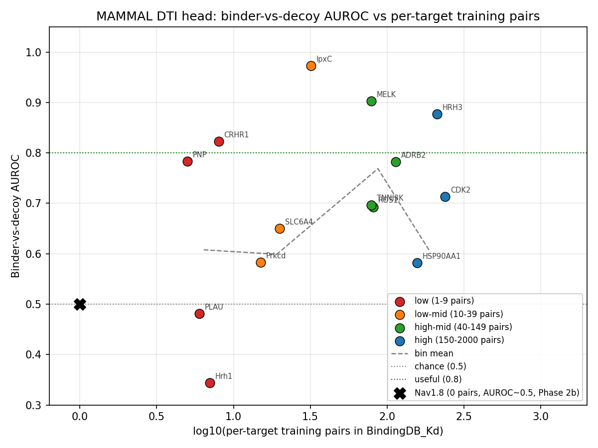

# Data gap or model limit? — MAMMAL DTI head diagnostic

**Author:** Rohan Aryagondi (Quiver) · **Date:** 2026-06-07 · **For:** Matt, Graham, internal Quiver
review. **Source of truth:** `results/datafit_summary.md` (synthesis) +
`results/datafit_ceiling.md` + `results/datafit_curve.md` + `results/dti_train_data_distribution.md` +
`results/offtarget_ube3a.md`. **Repo:** Q-Mammal · commit `5906d5e` on `main`.

---

## TL;DR

We tested whether the MAMMAL DTI head's **chance-level performance on Nav1.8** is explained by
a *data gap* (Nav simply isn't in the training set) or a *model limit* (the head can't represent
this kind of binding). The answer is **neither cleanly**:

> **Data volume is necessary but not sufficient.** Above ~150 training pairs the head's
> binder-vs-decoy quality is **bimodal** — some targets work brilliantly (AUROC 0.85+), others
> sit at or below chance — with no obvious class, size, or family predictor of which mode a
> target lands in. The Nav failure is *consistent with* a data gap but cannot be *attributed*
> to one. A Quiver Nav fine-tune is worth doing but is **not a guaranteed win**.

This refines the prior reading ("Nav fails because BindingDB never showed it a Nav; close the
gap and you're done") and changes the Quiver fine-tune decision from "free money" to "ROI-with-a-real-risk".

---

## What we asked & how we tested it

Graham raised this at the 2026-06-05 sprint check-in: the Nav binding result is hard to
interpret without knowing what the head was trained on. Rohan committed to three diagnostics,
all complete:

1. **Off-target sanity check** — does the head encode *any* target specificity? (1a)
2. **Training-data composition audit** — how skewed is BindingDB_Kd, is Nav in it? (1c)
3. **Where is the head actually data-suited?** — re-run the binder-vs-decoy test on targets
   that *are* well-supported in training, plus a stratified threshold curve. (1b)

All three use the **PEER DTI checkpoint** (the correct one for our problem classes,
norms 6.286 / 1.542) and exactly the same scoring protocol as the original Nav test, so
results are apples-to-apples with the failed Nav case.

---

## Headline findings

### 1. The DTI head has essentially **no off-target specificity off the shelf**

Score Nav-blocker drugs (suzetrigine, vixotrigine) against UBE3A (unrelated E3 ubiquitin
ligase, 875 aa — fits the truncation cap) and TUBB (tubulin, 444 aa). **Every drug × every
target sits in a 5.7–7.7 pKd band.** The on-target lean is +0.5 to +1.3 pKd, swamped by the
~2-pKd background spread; random background molecules (metformin, caffeine, ibuprofen) score
the same as the Nav drugs on the unrelated targets.

> The head emits "binds, ~pKd 7" for almost everything. A high pKd alone is **not evidence**
> that a compound actually binds the queried protein.

(Detail: `results/offtarget_ube3a.md`.)

### 2. BindingDB_Kd is severely **kinase-skewed**; Nav is absent

42,236 harmonized pairs across 1,090 UniProt targets. Composition by **real UniProt
keywords/families** (not name-keyword guessing):

| class | # targets | # pairs | % of pairs |
|---|---:|---:|---:|
| **kinase** | 388 | **30,743** | **72.8%** |
| other | 419 | 5,969 | 14.1% |
| gpcr | 166 | 3,726 | 8.8% |
| nuclear_receptor | 30 | 1,041 | 2.5% |
| **ion_channel** | 47 | **427** | **1.0%** |
| protease | 34 | 302 | 0.7% |

- The dataset is Gini-0.572 skewed. Top-10% of targets hold 30% of pairs.
- **Nav1.8 (SCN10A) is completely absent** — no target ID, and its 1,956-aa sequence + a
  50-aa internal probe match nothing in the data. The whole Nav/SCN family contributes
  **5 incidental, mostly-rodent pairs (0.012%)**.

So Graham's data-gap hypothesis is empirically correct in the narrow sense: the head was
never shown a Nav1.8 to learn from. (Detail: `results/dti_train_data_distribution.md` +
per-target CSV `results/dti_train_data_per_target.csv`.)

### 3. Where the data IS, the head works **inconsistently** — bimodally

Re-ran the Nav binder-vs-decoy protocol on 6 well-trained targets including **mTOR** (the
one Quiver target with hundreds of training pairs) plus a 16-target threshold sweep across
4 training-pair bins. Two views agree.

**Ceiling test (6 targets, full rig: random AUROC + MW-matched AUROC + Spearman + 6×6 off-target matrix):**

| accession | gene  | class            | n_pairs | AUROC random | AUROC matched | Spearman | off-target Δ |
|-----------|-------|------------------|--------:|-------------:|--------------:|---------:|-------------:|
| P51449    | RORC  | nuclear_receptor |     374 | **0.97**     | **0.95**      |  −0.10   | +0.68 |
| P00918    | CA2   | other (CA)       |     269 | **0.87**     | **0.84**      | **0.87** | **+1.97** |
| Q8K4Z4    | Adrb2 | gpcr             |     211 | **0.87**     | **0.88**      | **0.76** | +0.83 |
| P42345    | MTOR  | kinase **(Quiver)** | 192  | 0.76         | 0.56          |  0.27    | **−1.12** |
| P15056    | BRAF  | kinase           |  **532**| 0.47         | 0.46          |  0.45    | +1.18 |
| P31389    | HRH1  | gpcr             |     184 | 0.40         | 0.33          | −0.14    | +0.68 |

(Decision rule: AUROC ≥ 0.80 on both random *and* matched decoys = head clearly works.
Spearman has a leakage caveat for the PEER checkpoint — treat as upper bound.)

**Three of six targets land cleanly above the bar (RORC, CA2, Adrb2). The other three fail
or only half-pass.** Including BRAF — the *most*-trained target in the entire pool.

**Threshold curve (16 targets across 4 bins):**

| bin | range | n | mean AUROC ± std |
|---|---|---:|---:|
| low | 1–9 | 4 | 0.61 ± 0.20 |
| low-mid | 10–39 | 4 | 0.60 ± 0.28 |
| **high-mid** | **40–149** | **4** | **0.77 ± 0.09** ← peak |
| high | 150–2000 | 4 | 0.60 ± 0.23 ← σ doubles |

**The curve is non-monotonic.** AUROC climbs from 0.61 → 0.60 → **peaks at 0.77 in the
40–149 bin** → drops back to 0.60 at 150+, with σ doubling in the top bin. At high data
volumes individual targets split bimodally: MELK at 79 pairs hits 0.90, HRH3 at 211 hits
0.88, while FCGRT at 166 sits at 0.24 and HSP90AA1 at 157 at 0.58. (Detail:
`results/datafit_curve.md`.)

### 4. mTOR — the one Quiver target with rich training data — is **not a clean win**

mTOR sits in the partial-pass camp. AUROC on random decoys is decent (0.76), but it
**collapses to chance on MW-matched decoys (0.56)** and **inverts off-target (Δ −1.12)**:
mTOR binders score *lower* against mTOR than against the other 5 panel proteins.

The obvious mechanistic suspect is **truncation**: mTOR is 2,549 aa and the DTI head
truncates to 1,250. The kinase domain (~aa 2,182–2,516) is **outside** the truncation
window — the head reads HEAT-repeat / FAT / FRB regions, not the active site. One-script
follow-up: re-run mTOR with a kinase-domain window (aa 1975–2549) to test whether the
truncation is the whole story.

---

## What this changes vs the prior reading

| Prior belief | Updated reading |
|---|---|
| Nav fails because BindingDB never showed it a Nav. | Empirically true (5 incidental rodent pairs out of 42k). |
| Test on rich-data targets → confirm Nav failure was a data gap. | **Half do, half don't.** Data volume is necessary but not sufficient. |
| A Quiver Nav fine-tune closes the gap and rescues binder triage. | Lifts Nav off the 0-pair floor mechanically, but the high-data regime is bimodal — landing in the "good" mode is not guaranteed. Plan for go/no-go on held-out scaffold AUROC ≥ 0.80. |
| mTOR is the safe Quiver target with rich MAMMAL support. | mTOR random-only (0.76), collapses on matched (0.56), inverts off-target (Δ −1.12). Likely truncation, but **not** a turnkey MAMMAL win. |
| The DTI head encodes a coherent "binding to target X" signal. | AUROC and Spearman don't track each other. RORC discriminates binders from decoys at 0.97 but cannot rank-order them by potency (Spearman −0.10). BRAF cannot discriminate but does rank-order. The head encodes different binding signals on different targets. |

---

## Strategic implications for Quiver

1. **MAMMAL DTI off-the-shelf remains commodity enrichment, not a triage gate.** Same
   verdict as Phases 1–6, now with stronger empirical backing. Use cross-target re-ranking
   on compounds the head already ranks somewhere; never as a single-target binder/non-binder
   gate.
2. **The Quiver Nav fine-tune decision is now ROI-with-real-risk.** Worth doing — fine-tuning
   on Quiver data is the only path to a head IBM does not already cover. But: budget for
   the bimodal outcome. Set go/no-go on held-out scaffold AUROC; do not assume "more data → it works".
3. **mTOR specifically deserves the kinase-domain window re-test before any production use.**
   Cheap (~5 min), resolves whether mTOR's failure is truncation or a model limit.
4. **The next *diagnostic* question is bigger than Nav.** What property predicts whether a
   data-rich target lands in the "good" vs "bad" mode? Candidates: chemotype concentration
   of the training binders, BindingDB assay-type heterogeneity (Ki/Kd/IC50 mix), sequence-length /
   domain coverage relative to the 1250-aa truncation. Answering this would convert
   per-target MAMMAL fine-tuning from "fine-tune and hope" to "score the target on the
   predictor and decide upfront".

---

## What was actually run (reproducibility)

- **1a — off-target sanity check.** `experiments/offtarget_ube3a.py` → `results/offtarget_ube3a.md`.
  PEER DTI head; 5 drugs (2 Nav blockers + 3 background) × 3 targets (Nav1.8 + UBE3A + TUBB).
- **1c — DTI training-data audit.** `experiments/dti_data_distribution.py` →
  `results/dti_train_data_distribution.md`. PyTDC BindingDB_Kd, harmonized via `max_affinity`
  + `convert_to_log` (mirrors MAMMAL's data module). 1,089/1,090 Target_IDs resolved to
  UniProt; classified by Keywords + Protein families.
- **1b — ceiling + curve.** `experiments/datafit_ceiling.py` (6 targets, full rig) +
  `experiments/datafit_curve.py` (16 targets × 4 bins). Shared helpers in
  `mammal_quiver/datafit.py`. AUROC = tie-aware Mann-Whitney; Spearman uses average-rank for
  ties. Random decoys = SMILES from BindingDB compounds never measured against the target.
  Matched decoys = same pool, ±50 Da MW window per binder.

Run env: conda `mammal` (Python 3.11, `biomed-multi-alignment`, `PyTDC`). Wall time on M3 Pro
MPS: ~9 min ceiling + ~8 min curve. Total compute cost (laptop): negligible.

## Open questions / next steps

- **mTOR kinase-domain window probe** — single cheap test, resolves the truncation suspect.
- **Bimodality predictor** — Tanimoto diversity of training binders, BindingDB assay-type
  mix, domain coverage. Until we have this, MAMMAL on a new target is a 50/50.
- **Alternative DTI models on Quiver targets** — ConPLex (already wired in `baselines/`),
  Boltz-2 (AWS pilot queued), ADMET-AI for the ADMET layer. Comparison infrastructure
  exists in `experiments/compare{1,2,3,4,_all}.py`. *This is the next sprint's work.*
